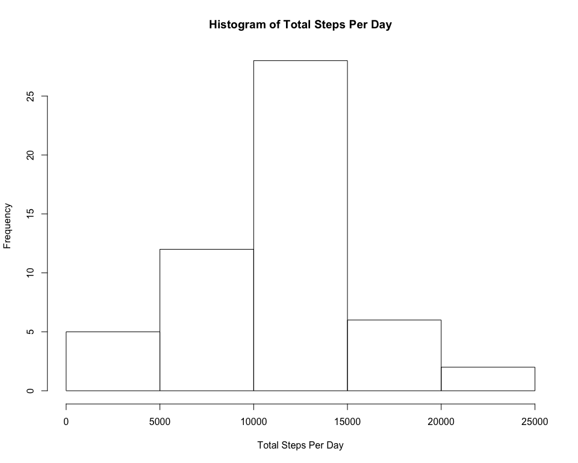
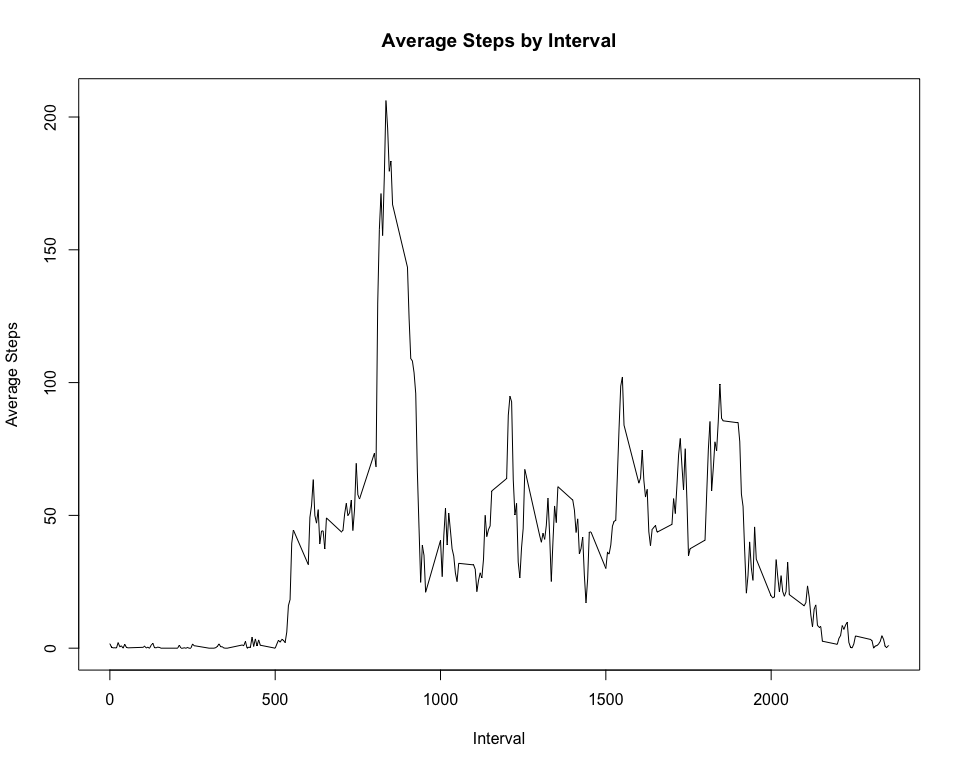
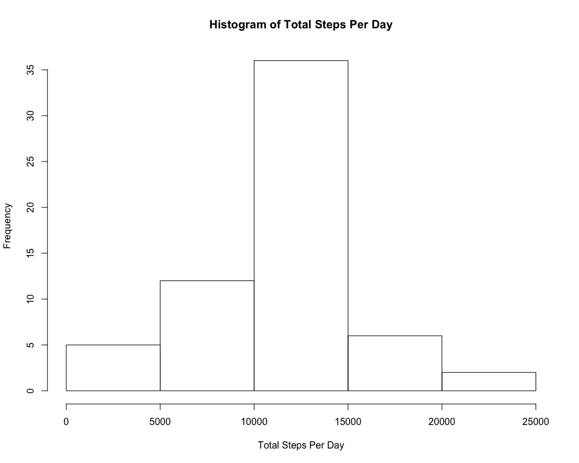
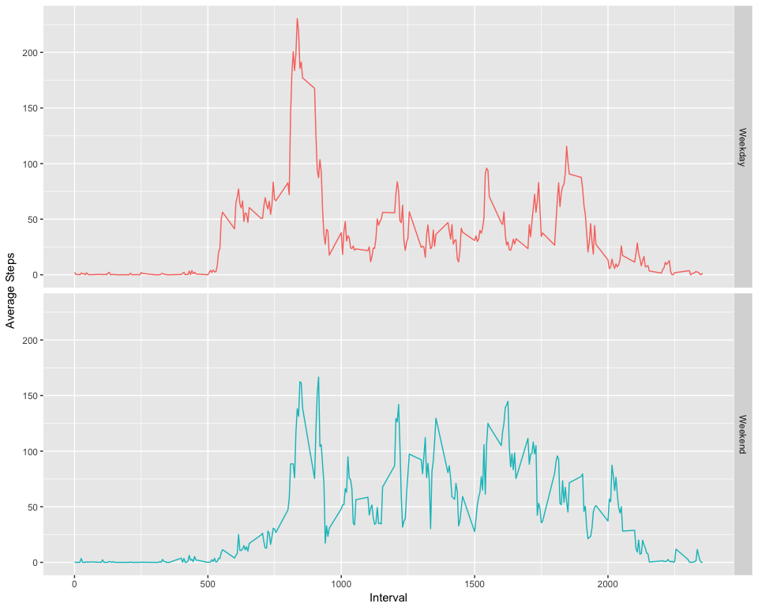

# Reproducible Research: Peer Assessment 1

## Loading and preprocessing the data

```r
# unzip and load the dataset, ensuring we end up with Date classes
unzip('activity.zip')
activity <- read.csv('activity.csv', colClasses = c('numeric', 'Date', 'numeric'))
```

## What is mean total number of steps taken per day?

### 1. Calculate the total number of steps taken per day

```r
# use aggregate to get total steps per day (tspd)
tspd <- aggregate(steps ~ date, data=activity, FUN=sum)
summary(tspd)
```

```
##       date                steps      
##  Min.   :2012-10-02   Min.   :   41  
##  1st Qu.:2012-10-16   1st Qu.: 8841  
##  Median :2012-10-29   Median :10765  
##  Mean   :2012-10-30   Mean   :10766  
##  3rd Qu.:2012-11-16   3rd Qu.:13294  
##  Max.   :2012-11-29   Max.   :21194
```

### 2. Make a histogram of the total number of steps taken each day

```r
hist(tspd$steps, 
     main = 'Histogram of Total Steps Per Day', 
     xlab = 'Total Steps Per Day')
```

<!-- -->

### 3. Calculate the mean and median of the total steps per d   bnm ay

```r
mean(tspd$steps)
```

```
## [1] 10766.19
```

```r
median(tspd$steps)
```

```
## [1] 10765
```

## What is the average daily activity pattern?

### 1. Make a time series plot

```r
# use aggregate to get mean steps per interval (mspi)
mspi <- aggregate(steps ~ interval, data=activity, FUN=mean)

plot(mspi$interval, 
     mspi$steps, 
     type = 'l',
     main = 'Average Steps by Interval',
     xlab = 'Interval',
     ylab = 'Average Steps')
```

<!-- -->

### 2. Which 5-minute interval, on average across all the days in the dataset, contains the maximum number of steps?

```r
maximumMSPI         <- max(mspi$steps)                  # find maximum mean step per interval
intervalWithMaxMSPI <- mspi[mspi$steps==maximumMSPI,1]  # locate the interval with that max
intervalWithMaxMSPI
```

```
## [1] 835
```

## Imputing missing values

### 1. Calculate and report the total number of missing values in the dataset

```r
sum(is.na(activity$steps))
```

```
## [1] 2304
```

### 2. Devise a strategy for filling in all of the missing values in the dataset. 
I chose the strategy of simply filling in the missing values with the mean value for the given interval.

### 3. Create a new dataset that is equal to the original dataset but with the missing data filled in.

```r
# tweak column names in the mean steps per interval data.frame to make the merged data.frame clearer
colnames(mspi) <- c('interval', 'meanSteps')

# merge in mean steps per interval data.frame with original data
activityFilled <- merge(activity, mspi, by='interval')

# fill in NAs with meanSteps
activityFilled$steps[is.na(activityFilled$steps)] <- activityFilled$meanSteps[is.na(activityFilled$steps)]
```

### 4. Make a histogram of the total number of steps taken each day and Calculate and report the mean and median total number of steps taken per day. 

```r
# create new total steps per day aggregate using filled in data
newTspd <- aggregate(steps ~ date, data=activityFilled, FUN=sum)

hist(newTspd$steps, 
     main = 'Histogram of Total Steps Per Day', 
     xlab = 'Total Steps Per Day')
```

<!-- -->

```r
mean(newTspd$steps)
```

```
## [1] 10766.19
```

```r
median(newTspd$steps)
```

```
## [1] 10766.19
```

### Do these values differ from the estimates from the first part of the assignment?  What is the impact of imputing missing data on the estimates of the total daily number of steps?  

The values different slighty, but filling in the mising values did not appear to have a significant impact on the totals.

## Are there differences in activity patterns between weekdays and weekends?

```r
require(ggplot2)
```

```
## Loading required package: ggplot2
```

```r
# add a "dayType" for weekend/weekday 
activityFilled$dayType[grepl('S(at|un)',  weekdays(activityFilled$date))] <- "Weekend"
activityFilled$dayType[!grepl('S(at|un)', weekdays(activityFilled$date))] <- "Weekday"

# create new mean steps aggregate by interval and weekend indicator
dayTypeAggregate <- aggregate(steps ~ dayType + interval, data=activityFilled, FUN=mean)

# plot a line graph showing average steps per interval for weekdays and weekends
ggplot(dayTypeAggregate, aes(interval, steps, color=dayType)) + 
  geom_line() +
  facet_grid(dayType ~ .) +
  xlab('Interval') +
  ylab('Average Steps') +
  theme(legend.position = 'none') 
```

<!-- -->

From the above graph it appears there is: 

  * More activity on weekdays during the earlier intervals  
  * More activity on weekends overall throughout the mid part of the day  
  * Also a bit more activity in the later intervals on the weekends  

